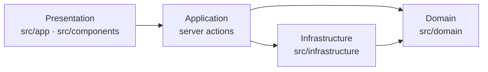
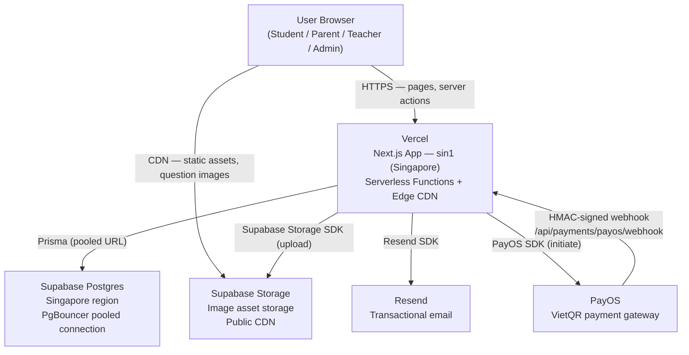

# Architecture Spine — ToanTuDuy

## Design Paradigm

**Pragmatic Clean / Layered** applied to a full-stack Next.js App Router monorepo.

Four named layers — each maps to a directory and a set of import rules:

| Layer | Directory | Allowed imports |
| --- | --- | --- |
| **Presentation** | `src/app/` `src/components/` | Domain types, server actions (via `use server`), shadcn/ui |
| **Application** | `src/app/**/actions.ts` (server actions) | Domain layer, Infrastructure layer |
| **Domain** | `src/domain/` | Nothing outside `src/domain/` |
| **Infrastructure** | `src/infrastructure/` | Domain types, `@prisma/client`, external SDKs |

Dependency direction — the single enforced rule that keeps layers from collapsing:



Domain is the dependency sink. No arrow may point at Presentation or Application from below.

---

## Invariants & Rules

### AD-1 — Full-stack Next.js monorepo, no separate backend service

- **Binds:** all surfaces (student, parent, teacher, admin)
- **Prevents:** a frontend/backend split introducing a separate deployment, a versioned REST/GraphQL contract, and cross-service auth propagation on v1
- **Rule:** All server-side logic — mutations, queries, business rules — lives in the Next.js monorepo via server actions and route handlers. No standalone API service in v1.

### AD-2 — Pragmatic clean architecture layer boundaries

- **Binds:** all `src/` code
- **Prevents:** DB calls or external SDK calls appearing directly inside React components; business logic leaking into route handlers
- **Rule:** React components (Presentation) must not import from `src/domain/` or `src/infrastructure/`. Server actions are the only entry point into the application from the presentation layer. Domain use cases must not import from `@prisma/client`, Next.js, or any external SDK.

### AD-3 — PostgreSQL (Supabase) + Prisma ORM; two connection strings

- **Binds:** all DB access, `prisma/schema.prisma`, CI migrations
- **Prevents:** connection pool exhaustion on Vercel serverless caused by using the direct connection at runtime
- **Rule:** `DATABASE_URL` (direct connection) is used only by `prisma migrate` and `prisma db seed`. All runtime DB access uses `DATABASE_URL_POOLED` (Supabase PgBouncer). Both must be set in Vercel environment variables.

### AD-4 — Auth via NextAuth v5; roles in JWT; three account types

- **Binds:** all authenticated surfaces and server actions
- **Prevents:** each surface re-implementing its own session mechanism; client-supplied role claims being trusted
- **Rule:** Authorization must always read `session.user.role` from the server-side NextAuth session. Client-side session data is for display only. Account types: `PARENT`, `TEACHER`, `ADMIN`. Google OAuth is enabled for Parent accounts only; Teacher and Admin accounts use email/password exclusively.

### AD-5 — Child Profile selection via signed cookie, not a separate auth step

- **Binds:** student surface, parent surface session handoff
- **Prevents:** a separate login flow for children; mixing childProfileId into the NextAuth JWT (which would require re-issuing tokens on profile switch)
- **Rule:** After a parent authenticates and selects a Child Profile, `childProfileId` is stored in a signed, `httpOnly` cookie scoped to the session. The student surface reads `childProfileId` from this cookie server-side. The parent surface reads `parentAccountId` from the NextAuth session. These two claims never coexist in the same JWT.

### AD-6 — Teacher account approval gate enforced at sign-in and at route level

- **Binds:** Teacher Portal routes (`/teacher/*`), NextAuth sign-in callback
- **Prevents:** a PENDING or REJECTED teacher from accessing the Teacher Portal
- **Rule:** The NextAuth `signIn` callback must reject sign-in when `teacher.status !== 'APPROVED'`. Teacher Portal server actions and layouts must additionally verify `status === 'APPROVED'` server-side — the JWT role claim alone is insufficient because status can change after token issuance.

### AD-7 — Vercel (Singapore) + Supabase (Singapore); regions must match

- **Binds:** deployment configuration, infrastructure setup
- **Prevents:** 200–300ms cross-region latency between compute and database on every request
- **Rule:** The Vercel project region must be `sin1` (ap-southeast-1). The Supabase project must be created in the Singapore region. This is an irreversible infrastructure decision — set at project creation.

### AD-8 — Teacher class reports are load-on-visit; no persistent connections in v1

- **Binds:** Teacher Portal data-fetching strategy
- **Prevents:** WebSocket or SSE infrastructure being added for a "check results next morning" use case
- **Rule:** Teacher Portal pages fetch completion data via Next.js Server Components on navigation. No `socket.io`, SSE endpoints, or long-polling for teacher report data in v1. Real-time updates are deferred to v2.

### AD-9 — Payment via PayOS webhook; subscription state mutated only through the verified webhook handler

- **Binds:** `/api/payments/payos/webhook`, `Subscription` DB records, subscription activation flow
- **Prevents:** a client-side call or a server action directly activating a subscription without payment confirmation; replay attacks
- **Rule:** The PayOS webhook handler at `/api/payments/payos/webhook` must verify the HMAC-SHA256 signature on every inbound request before mutating any DB record. `Subscription.status` transitions (`PENDING_PAYMENT → ACTIVE`, `ACTIVE → EXPIRED`) are only valid from this handler or from a scheduled expiry job — never from a client-invoked server action.

### AD-10 — Admin panel as custom `/admin/*` route group; role-gated server-side

- **Binds:** all `/admin/*` routes and server actions
- **Prevents:** a separate admin deployment; client-side role checks as the only gate
- **Rule:** Every `/admin/*` layout and server action must verify `session.user.role === 'ADMIN'` server-side and return 403/redirect otherwise. Admin surface covers: Teacher account approval, global session parameter configuration (question count, Free Tier daily allotment), question CRUD.

### AD-11 — Adaptive difficulty is a pure domain use case; sliding-window algorithm

- **Binds:** `src/domain/use-cases/adaptive-difficulty.ts`, session question-selection flow
- **Prevents:** algorithm logic leaking into DB queries, server actions, or UI components; the algorithm becoming untestable in isolation
- **Rule:** The use case signature is `selectNextQuestion(skillAccuracyHistory: SkillAccuracyWindow[], availableQuestions: Question[]): Question`. It has zero imports from `@prisma/client`, Next.js, or any external SDK. Algorithm: per-Skill sliding window over the last N answered questions (default `N=10`); increase Difficulty Level when accuracy > `ACCURACY_UP_THRESHOLD` (default 0.80); decrease when < `ACCURACY_DOWN_THRESHOLD` (default 0.50). `N` and both thresholds are exported constants in `src/domain/constants.ts` — tunable without code changes elsewhere.

### AD-12 — Question content enters via seed scripts or admin CRUD; never hard-coded

- **Binds:** `prisma/seed.ts`, `/admin/questions/*`, the Question domain entity
- **Prevents:** question content being embedded in application logic; questions existing only in code that can't be updated by non-developers
- **Rule:** The initial question corpus is loaded via `prisma/seed.ts` from structured JSON fixtures in `prisma/fixtures/`. Ongoing question authoring uses the `/admin/questions` CRUD UI. A question's `imageUrl` field must always be a fully-qualified CDN URL (from Supabase Storage) or `null` — never a relative path or a blob.

### AD-13 — Question images in Supabase Storage; referenced as CDN URLs in Postgres

- **Binds:** `Question.imageUrl`, admin question authoring upload flow, student surface image rendering
- **Prevents:** binary assets in Supabase Postgres; images being served without a CDN
- **Rule:** Image upload goes through `src/infrastructure/storage/supabase-storage.ts` (using the Supabase JS client's Storage API). Images are stored in a public bucket; the resulting public CDN URL is stored in `Question.imageUrl`. The student surface renders images directly from this CDN URL — no proxying through the Next.js server. Supabase Storage is preferred over a separate vendor (R2) to keep the storage and database on a single platform.

### AD-14 — Transactional email via a single Resend adapter; no direct SDK calls from surfaces

- **Binds:** subscription confirmation flow, teacher approval/rejection flow, `src/infrastructure/email/`
- **Prevents:** Resend being called directly from multiple server actions or route handlers; email templates drifting across surfaces
- **Rule:** All outbound email goes through `src/infrastructure/email/resend.ts`. No `src/app/` code may import from the Resend SDK directly. Triggers in v1: subscription activated (parent), teacher account approved (teacher), teacher account rejected (teacher).

---

## Consistency Conventions

| Concern | Convention |
| --- | --- |
| **File naming** | kebab-case for all files and directories (`adaptive-difficulty.ts`, `child-profile-repository.ts`) |
| **Type/entity naming** | PascalCase for types and interfaces (`ChildProfile`, `SessionAnswer`); camelCase for functions and variables |
| **Database IDs** | `cuid2` (via Prisma `@default(cuid())`) for all primary keys — URL-safe, collision-resistant, no UUID dependency |
| **Dates** | All timestamps stored as `DateTime` (UTC) in Prisma; serialized as ISO 8601 UTC strings across the wire |
| **Server action return shape** | `{ data: T } \| { error: { code: string; message: string } }` — never throw from a server action; errors are returned, not thrown |
| **Authorization** | Every server action begins with a session check; absence of a session returns `{ error: { code: 'UNAUTHORIZED', message: '...' } }` |
| **Environment config** | All secrets and config via environment variables; no hard-coded credentials anywhere in `src/`; `src/lib/env.ts` exports validated env vars using `zod` |
| **Vietnamese string literals** | UI-visible Vietnamese strings live in locale files under `src/locales/vi/`; no inline Vietnamese in component code |
| **Prisma schema** | One schema file (`prisma/schema.prisma`); all relations explicit; no raw SQL in application code except through `prisma.$queryRaw` where unavoidable |

---

## Stack

| Name | Version |
| --- | --- |
| Next.js (App Router) | 15 |
| React | 19 |
| TypeScript | 5 |
| Prisma | 6 |
| NextAuth / Auth.js | 5 |
| Tailwind CSS | 4 |
| shadcn/ui | latest |
| PostgreSQL (Supabase managed) | 17 |
| Zod (env validation + form schemas) | 3 |
| PayOS Node SDK | latest |
| Resend | latest |
| @supabase/supabase-js (Storage) | 2 |
| React Email | latest |
| Vercel | platform |
| Supabase | platform |
| Supabase Storage | platform (via Supabase) |

---

## Structural Seed

### Source tree

```text
src/
  app/                          # Next.js App Router — all routes and server actions
    (student)/                  # Student surface route group (no auth header required)
      session/                  # Active practice session UI
      summary/                  # Post-session summary
    (parent)/                   # Parent surface route group (role: PARENT)
      dashboard/                # Parent Dashboard — Skill breakdown, weekly activity
      profiles/                 # Child Profile management
      subscription/             # Subscription status and upgrade flow
    (teacher)/                  # Teacher Portal route group (role: TEACHER, status: APPROVED)
      assignments/              # Assignment Set creation and management
      classes/                  # Class management
      reports/                  # Class Report — completion and per-Skill averages
    admin/                      # Admin panel (role: ADMIN)
      teachers/                 # Teacher account approval queue
      questions/                # Question CRUD + image upload
      config/                   # Global session parameter configuration
    api/
      auth/[...nextauth]/       # NextAuth route handler
      payments/
        payos/
          webhook/              # PayOS payment confirmation webhook
  domain/                       # Pure domain layer — zero framework dependencies
    entities/                   # TypeScript types: ChildProfile, Question, Session, etc.
    use-cases/
      adaptive-difficulty.ts    # SelectNextQuestion use case
      session-scoring.ts        # Session summary computation
    constants.ts                # Configurable algorithm constants (WINDOW_SIZE, thresholds)
  infrastructure/               # External-facing adapters
    repositories/               # Prisma-backed data access (one file per aggregate)
      child-profile-repository.ts
      question-repository.ts
      session-repository.ts
      subscription-repository.ts
      teacher-repository.ts
    email/
      resend.ts                 # Resend adapter — all outbound email
    storage/
      supabase-storage.ts       # Supabase Storage adapter — image upload
    payment/
      payos.ts                  # PayOS adapter — payment initiation + webhook verification
  components/                   # Shared UI (shadcn/ui wrappers, domain-aware widgets)
    ui/                         # Raw shadcn/ui exports (untouched)
    student/                    # Student-surface components (question card, feedback, etc.)
    parent/                     # Parent-surface components (skill badge, streak, etc.)
    teacher/                    # Teacher-surface components (class report table, etc.)
  lib/
    auth.ts                     # NextAuth config (providers, callbacks, session shape)
    env.ts                      # Zod-validated environment variables
    child-profile-cookie.ts     # Sign / verify childProfileId cookie
    utils.ts                    # Shared utilities (cn, formatDate, etc.)
prisma/
  schema.prisma                 # Single source of truth for DB schema
  seed.ts                       # Seeds initial question corpus from fixtures
  fixtures/                     # JSON question fixtures (grade-band × skill × difficulty)
```

### Core entity relationships

```mermaid
erDiagram
    User {
        string id PK
        string email
        enum role "PARENT | TEACHER | ADMIN"
    }
    ParentAccount {
        string id PK
        string userId FK
    }
    ChildProfile {
        string id PK
        string parentAccountId FK
        string name
        enum gradeBand "GRADE_1 | GRADE_2 | GRADE_3"
    }
    Subscription {
        string id PK
        string parentAccountId FK
        enum status "PENDING_PAYMENT | ACTIVE | EXPIRED | CANCELLED"
        datetime renewsAt
    }
    TeacherAccount {
        string id PK
        string userId FK
        enum status "PENDING | APPROVED | REJECTED"
    }
    Class {
        string id PK
        string teacherAccountId FK
        string name
    }
    ClassMembership {
        string id PK
        string classId FK
        string childProfileId FK
    }
    Skill {
        string id PK
        string code
        string name
    }
    Question {
        string id PK
        string prompt
        string imageUrl "CDN URL or null"
        json choices
        string correctAnswer
        string skillId FK
        enum gradeBand
        int difficultyLevel "1–5"
    }
    Session {
        string id PK
        string childProfileId FK
        datetime completedAt
        int questionCount
        int correctCount
    }
    SessionAnswer {
        string id PK
        string sessionId FK
        string questionId FK
        bool answeredCorrectly
        int difficultyLevelAtAnswer
    }
    AssignmentSet {
        string id PK
        string teacherAccountId FK
        string classId FK
        string title
        datetime dueAt
    }
    AssignmentSetQuestion {
        string id PK
        string assignmentSetId FK
        string questionId FK
    }
    GlobalConfig {
        string id PK
        string key
        string value
    }

    User ||--o| ParentAccount : "is"
    User ||--o| TeacherAccount : "is"
    ParentAccount ||--o{ ChildProfile : "manages"
    ParentAccount ||--o| Subscription : "holds"
    ChildProfile ||--o{ Session : "completes"
    Session ||--o{ SessionAnswer : "contains"
    SessionAnswer }o--|| Question : "answers"
    Question }o--|| Skill : "tagged"
    TeacherAccount ||--o{ Class : "owns"
    Class ||--o{ ClassMembership : "has"
    ClassMembership }o--|| ChildProfile : "links"
    TeacherAccount ||--o{ AssignmentSet : "creates"
    AssignmentSet ||--o{ AssignmentSetQuestion : "contains"
    AssignmentSetQuestion }o--|| Question : "references"
```

### Deployment topology



---

## Capability → Architecture Map

| PRD Capability / Area | Lives in | Governed by |
| --- | --- | --- |
| Student practice session (FR-1–FR-4) | `src/app/(student)/session/` | AD-1, AD-5, AD-11 |
| Adaptive question selection | `src/domain/use-cases/adaptive-difficulty.ts` | AD-2, AD-11 |
| Immediate post-answer feedback | `src/app/(student)/session/` (client component) | AD-1 |
| Session summary (FR-4) | `src/app/(student)/summary/` | AD-1 |
| Free Tier daily allotment gate (FR-1) | `src/app/(student)/` layout server action | AD-2, AD-10 |
| Parent Dashboard — Skill breakdown (FR-9–FR-14) | `src/app/(parent)/dashboard/` | AD-1, AD-4 |
| Child Profile management (FR-15–FR-16) | `src/app/(parent)/profiles/` | AD-4, AD-5 |
| Subscription + payment flow (FR-17) | `src/app/(parent)/subscription/` + `/api/payments/payos/webhook` | AD-9, AD-14 |
| Teacher Portal — Assignment Sets (FR-18–FR-21) | `src/app/(teacher)/assignments/` | AD-4, AD-6 |
| Teacher Portal — Class Reports (FR-22–FR-24) | `src/app/(teacher)/reports/` | AD-6, AD-8 |
| Teacher account approval | `src/app/admin/teachers/` | AD-6, AD-10 |
| Question authoring / CRUD | `src/app/admin/questions/` | AD-10, AD-12, AD-13 |
| Global session config (FR-27) | `src/app/admin/config/` | AD-10 |
| Image upload for questions | `src/infrastructure/storage/supabase-storage.ts` | AD-13 |
| Transactional email (subscription + approval) | `src/infrastructure/email/resend.ts` | AD-14 |
| Auth — all surfaces | `src/lib/auth.ts` (NextAuth config) | AD-4, AD-6 |
| Child Profile cookie | `src/lib/child-profile-cookie.ts` | AD-5 |
| Env config + secrets | `src/lib/env.ts` (Zod) | Consistency conventions |

---

## Deferred

| Decision | Why deferred | Revisit when |
| --- | --- | --- |
| Real-time teacher class reports (SSE / WebSocket) | Load-on-visit meets the "next morning" use case; AD-8 explicitly defers. No infrastructure cost justified by v1 usage. | Teacher Portal DAU grows; teachers request live updates during class. |
| Grade 4–5 content and Grade Band expansion | v1 scope is Grade 1–3 only (PRD §2.2). Algorithm and schema support it (gradeBand is an enum field). | v2 roadmap. |
| Annual subscription pricing and billing cycle | PRD flags as TBD. PayOS and subscription state machine support it; no schema change required. | Pricing experiments post-launch. |
| Grade Band auto-progression | PRD explicitly defers: Grade Band does not change automatically; parents set it. | v2 based on learning outcomes data. |
| ZaloPay / additional payment providers | AD-9 defers. PayOS adapter is isolated; adding a second provider is an infrastructure-layer addition. | Payment volume data shows demand. |
| Google OAuth for Teacher / Admin accounts | AD-4 restricts Google OAuth to Parent accounts only for v1. | Post-v1 if teacher onboarding friction is measured as a drop-off. |
| Student leaderboards, streaks between friends, social features | Not in PRD scope for v1; engagement mechanics are per-Child Profile only. | v2 social/retention design pass. |
| Question import via CSV / bulk upload | AD-12 defers to seed + CRUD. Bulk CSV import is an admin UX enhancement. | Content team grows past 2 people. |
| Multi-language support (outside Vietnamese) | PRD explicitly out of scope for v1. | International expansion. |
| Mobile native app (iOS / Android) | Web-only for v1. | v2 if mobile traffic warrants it. |
